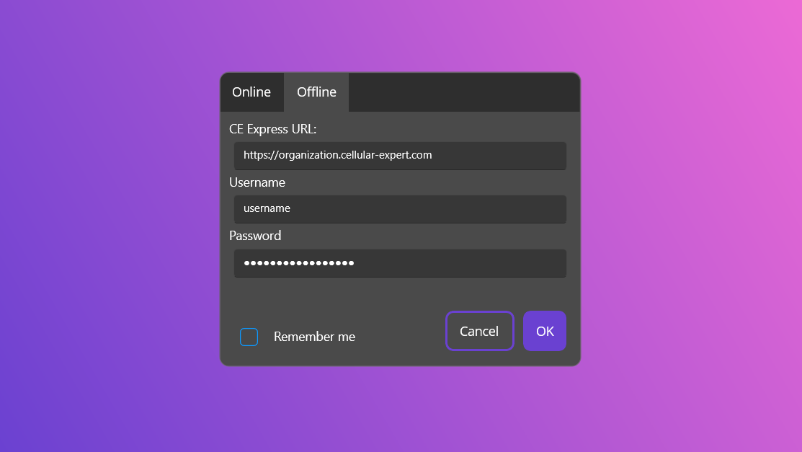

# CERA (Cellular-Expert Runtime Application)

An open-source sample application built with ArcGIS Maps SDK and .NET MAUI to demonstrate integration with the Cellular Expert (CE) Express API.

[](license.txt)

## 📖 Introduction

**CERA** (CE Runtime App) is multi-platform reference app for developers that demonstrates how to integrate the **Cellular Expert (CE) API** into ArcGIS Maps SDK applications. It is built using .NET MAUI allowing for multi-platform support, in a single codebase. 

With this project, developers can learn how to:
* Use the Quick RF Prediction API.
* Use the Profile Calculation API.
* Extend or adapt CE Express functionality in their own applications.


To run this application, you’ll need access to:
* ArcGIS Enterprise portal
* CE Express API ([contact](https://www.cellular-expert.com/#Contacts))

👉 A sample San Francisco dataset is included with CE Express installation.

---
## 📦 Getting Started

### ✅ Prerequisites

- [.NET 9.0 SDK](https://dotnet.microsoft.com/en-us/download/dotnet/9.0)
- [CE Express Server](https://www.cellular-expert.com/#Products)
- [Esri API key](https://developers.arcgis.com/documentation/security-and-authentication/api-key-authentication/tutorials/create-an-api-key)

🔑 For full functionality, add your ArcGIS API key to MauiProgram.cs
* If no API key is provided, you can still run the app in Offline mode, which loads the sample San Francisco mobile map package.

---

### 🛠️ Installation

Clone the repository:

```bash
git clone https://github.com/CellularExpertTeam/CERA.git
```

⚠️ For any Workspaces using less common Spatial References, it is important to download the Projection Engine Data from https://developers.arcgis.com/net/downloads To set it up for this project. Download the Projection engine data v200.8.0 zip file, extract it and put the Projection_Engine_Data_200_8_0 folder into Defencev1/Data.


---

### 🌎 User Reference
To get started, input CE Express server URL and user credentials. Choose Offline, If you would like to test out the application without a API Key. If you try to log in into Online mode, without a API Key, no map will be loaded.

Once logged in, chooose the workspace panel on the left side control panel. And select a workspace, a sample San Fransisco workspace is already provided.

To make a Quick RF Prediction, choose the first panel from the rigth side tool pane, set up your parameters and select a point on the map, within your workspace.

To make a Profile, choose the second tool from the right side tool pane, configure transmitter and receiver parameters and select 2 points on the map to draw a line.


